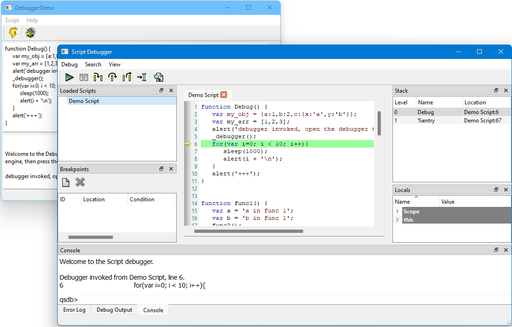

# NeoScriptTools
NeoScriptTools is a Qt6-compatible fork of Qt4 ScriptTools. It was initially developed to facilitate remote debugging and debugging of the Google V8 engine using the now deprecated debugger protocol on port 9222.

## V4ScriptDebugger
V4ScriptDebugger is a new module that allows you to use the old Qt Script Debugger UI for debugging the new Qt6/Qt5 QJSEngine (internally called V4).

To use V4ScriptDebugger in any commercial project, you are required to obtain an appropriate business use license. Please contact me (David Xanatos) via email, which is available in my Github profile, to purchase a license.

### Usage
To use V4ScriptDebugger, you need to replace the QJSEngine in your project with CV4EngineExt and use the evaluateScript function instead of evaluate.
Next, instantiate a CV4ScriptDebuggerBackend, which must reside in a separate thread from where the CV4EngineExt exists. The Backend must be connected to the engine using CV4ScriptDebuggerBackend::attachTo. Connection between CJSScriptDebuggerFrontend and CV4ScriptDebuggerBackend is established by connecting CJSScriptDebuggerFrontend::sendRequest with CV4ScriptDebuggerBackend::processRequest, and CV4ScriptDebuggerBackend::sendResponse with CJSScriptDebuggerFrontend::processResponse. This connection can be achieved either through signals & slots or by serializing the QVariants used for communication (e.g., to JSON) and sending them over a socket or pipe between the debugger and the debuggee.
Finally, create an instance of CJSScriptDebugger, connect it to the frontend using CJSScriptDebugger::attachTo, and display it using CJSScriptDebugger::show.

## V8ScriptDebugger
V8ScriptDebugger is an old module that allows debugging of an older V8 engine using the Qt Script Debugger UI. It is included here for completeness, but it may not be compatible with modern versions of the V8 engine. If you require this functionality to work with the latest Google V8 Engine, please contact me (David Xanatos).

## DebuggerDemo
The Debugger Demo project provides a simple UI to test the debugger with different engines.

# Known Issues
- When compiled with Qt6, the debugger console commands are not available, as they were internally implemented using the no longer available QScriptEngine. This functionality could be ported to use QJSEngine. If you require this feature, please reach out to me (David Xanatos).
- As the original unmodified V4 engine does not provide a mechanism to retrieve the source code for a script, it is necessary to use the derived CV4EngineExt. Additionally, since QJSEngine::evaluate is not a virtual function, CV4EngineExt::evaluateScript must be used instead.
- Some minor commands of the old QScriptEngine are not available: GetPropertyExpressionValue, GetCompletions, ForceReturn, ScriptValueToString
- The V8ScriptDebugger currently does not support the new inspector protocol.
